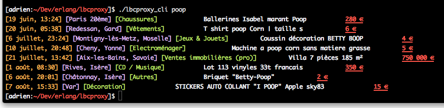

Lbcproxy
========

Command Line Interface to the number one classifieds website in France:
_leboncoin.fr_.

Interface en ligne de commande pour le site de petites annonces numero un en
France: _leboncoin.fr_.



## Installation

Requiert [Elixir](http://elixir-lang.org) 1.0 ou supérieur.

```
$ mix deps.get
$ mix escript.build
```

## Utilisation

```
$ ./lbcproxy_cli                                                                                                                                                                                                                     (master✱) 
  Usage:
  ./lbcproxy_cli porsche cayenne --category voitures
  Options:
  --category Specify search section
  --region Specify search region
  --help  Show this help message.
  --help-categories  Show the list of available categories.
  --help-regions Show the list of available regions.
  Description:
  Searches www.leboncoin.fr for a given product.
```

La région par défaut si l'option n'est pas spécifiée est la France entière,
via la page Ile de France.

Cherche par défaut dans toutes les catégories

## Exemple

```
$ ./lbcproxy_cli poop --region rhone_alpes                                                                                                                                                                                           (master✱) 
[21 juillet, 13:42] [Aix-les-Bains, Savoie] [Ventes immobilières (pro)]		Villa 7 pièces 185 m²		750 000 €
[1 août, 08:30] [Rives, Isère] [CD / Musique]		Lot 113 vinyles 33t francais		350 €
[6 août, 20:01] [Châtonnay, Isère] [Autres]		Briquet "Betty-Poop"		2 €
```

## TODO

* Option pour désactiver la couleur
* Option pour spécifier le nombre de résultats max désirés
* Recherche dans un département particulier au lieu de toute la région
* Support des options particulières de recherche (fourchettes de prix, etc.)
* Improve error messages when wrong option

